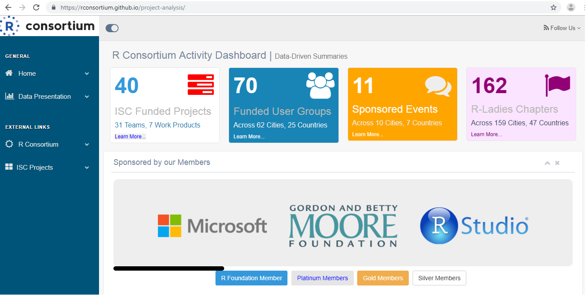

# Data-Driven Discovery and Tracking of R Consortium Activities

This is an infrastructure that provides a data-driven approach to render the yearly activities of the R Consortium, by deploying web pages for discovering and tracking ISC Funded Projects, RUGS and Event activities. These pages are planned to appear like dashboards summarizing activities in interactive tables and charts, presenting several views, trends and insights to what R Consortium has achieved over time. 

The project hopes that presenting these achievements in a data-driven manner to the R community, the data science community and prospective R Consortium members will promote greater transparency, productivity and community inclusiveness around R Consortium activities.

### Landing (Home) Page
[https://rconsortium.github.io/project-analysis/](https://rconsortium.github.io/project-analysis/)

### ISC Projects Dashboard: 
[https://rconsortium.github.io/project-analysis/isc.html](https://rconsortium.github.io/project-analysis/isc.html)

### RUGS Program Dashboard: 
[https://rconsortium.github.io/project-analysis/rugs.html](https://rconsortium.github.io/project-analysis/rugs.html)

### Events Program Dashboard
[https://rconsortium.github.io/project-analysis/events.html](https://rconsortium.github.io/project-analysis/events.html)
